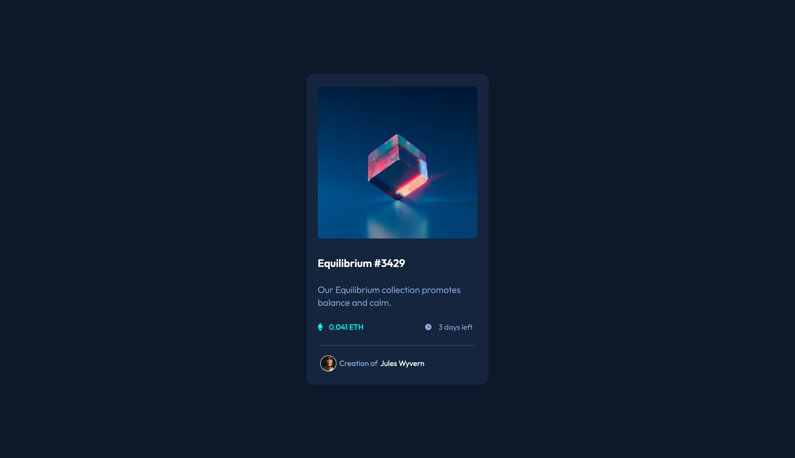

# Frontend Mentor - NFT preview card component solution

This is a solution to the [NFT preview card component challenge on Frontend Mentor](https://www.frontendmentor.io/challenges/nft-preview-card-component-SbdUL_w0U). Frontend Mentor challenges help you improve your coding skills by building realistic projects. 

## Table of contents

- [Overview](#overview)
  - [The challenge](#the-challenge)
  - [Screenshot](#screenshot)
  - [Links](#links)
- [Author](#author)

## Overview

### The challenge

Users should be able to:

- View the optimal layout depending on their device's screen size
- See hover states for interactive elements

### Screenshot

### Links

- Solution URL: [GitHub](https://github.com/navalBhagat/nft-preview-card-component-fe-mentor)
- Live Site URL: [Vercel](https://nft-preview-card-component-fe-mentor-gdba3scrz.vercel.app)

## Author

- Frontend Mentor - [@navalBhagat](https://www.frontendmentor.io/profile/navalBhagat)
